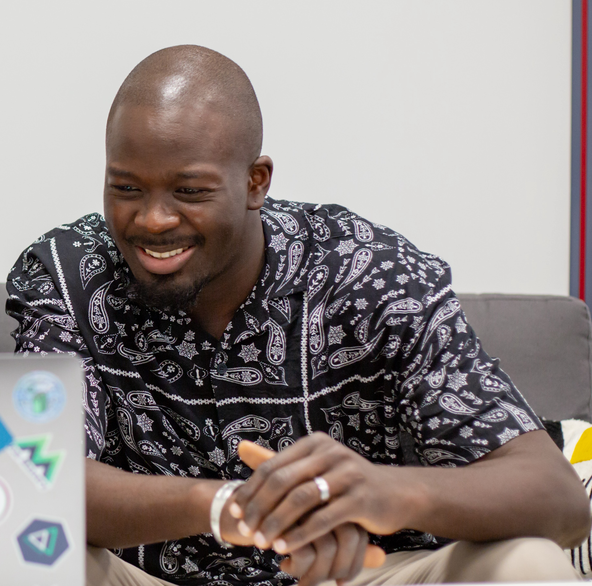

I enjoy frontend development because it allows me to build cool interfaces and play with API'S.

I have always wanted to work in IT since childhood but I never took that direction at school.

In 2018, I decided to learn coding on my own for 6 months  with sites such as [OpenClassrooms](https://example.com) & [Freecodecamp ](https://example.com) after a career as a textile salesman and handler.

After learning on my own I enrolled in a bootcamp in my city that lasted 10 months, I learned **HTML/CSS, Javascript and Php.**  The method was to learn by doing projects, with a period in a company too.
During this bootcamp the COVID arrived the training was suspended for 2-3 months because of the lockdown, I took the opportunity to learn **React Js**  on the internet, this period really gave me the love of code
At final, _I got my diploma as a web developer with success._ ✨🎉

After this first bootcamp I decided to continue on another bootcamp with <a href="https://www.wildcodeschool.com/en-GB" target="_blank">Wild Code School</a> over 1 year in part-time (_3 weeks in company, 1 week at school_). My goal was to learn more about Javascript, the program was: **React, Node, Express, Typescript & testing.** And this training will give me a higher level, a Bachelor degree.

I found a great digital agency <a href="https://web-id.fr/" target="_blank">Web^ ID</a> who gave me the chance to join them and be part of the frontend team where we worked mainly on **Vue JS & React JS.**  I had a great welcome, a great mentor and a caring team. I was in remote due to COVID and my location (I live 300km away from the company).

 **_My story is to be continued._** 

